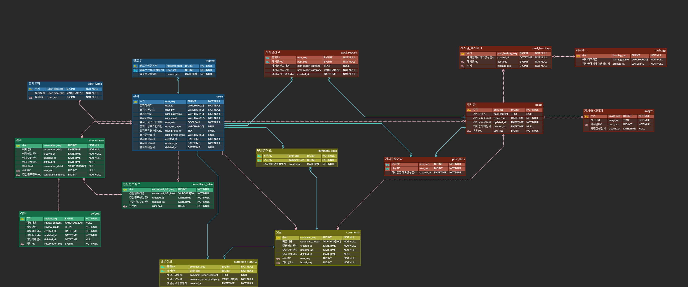

# 2023-07-17

### 태현
1. 팀 회의 진행
    - ERD 설계 마무리
    - API 기능 명세
2. ERD 설계 마무리
    - 
3. API 기능 명세(노션 링크)
    - https://www.notion.so/API-d41cb070f3e14dfd935a144ef888a65d?pvs=4

## 상우

### 23.07.17 
- ERD 최종 설계 후 컨설턴트님과 피드백 진행
    - ENUM 타입을 VARCHAR로 변경
    - 라이브 시스템 로그 관련 파일 추가
    - 모든 컬럼에 대한 제약조건과 데이터타입을 설정한 이유가 있어야 함

- API 명세서 설계
    - 유저, 관리자, 인증 담당

    

# 7월 17일 월요일
Team Notion Link : https://www.notion.so/Infinity-1ffdc59b4bde4804a4f8bbc569c1e9d2

## ERD 완료 및 DB 생성

* 컨설턴트님께 검토 완료

## 컨설턴트 및 컨설팅 페이지 API 명세서 작성 (지원이랑)
* status code 별 message 작성

* 컨설턴트님께 검토 완료

## 컨설턴트 및 컨설팅 페이지 API 명세서 작성 (with 배이경)
* status code 별 message 작성 

* GET - Header(Authentication), Parameter, 200 message
* POST - Header(Authentication), Body
* PUT - Header(Authentication), Body
* DELETE - Header(Authentication), 200 message

## 내일 할 일
* ERD & DB 수정 : 컨설턴트가 예약 가능한 시간대를 모아볼 수 있는 별도 테이블이 필요함 (How 는 내일 논의)
* Figma 빠진 화면 추가

    * 내가 컨설팅 받은 내역 페이지
    * 컨설턴트 목록 페이지 & 검색
    * 컨설팅 후기 작성 페이지 또는 모달

    * 내가 컨설팅 받은 내역 페이지 
    * 컨설턴트 목록 페이지 & 검색
    * 컨설팅 후기 작성 페이지 또는 모달

오늘 한 일
- ERD 구조 조정 및 2차 컨펌
- 도메인별 파트 분담
    - 게시판 도메인 담당
- API명세서 작성
    - 게시판 관련 API 명세서 작성

