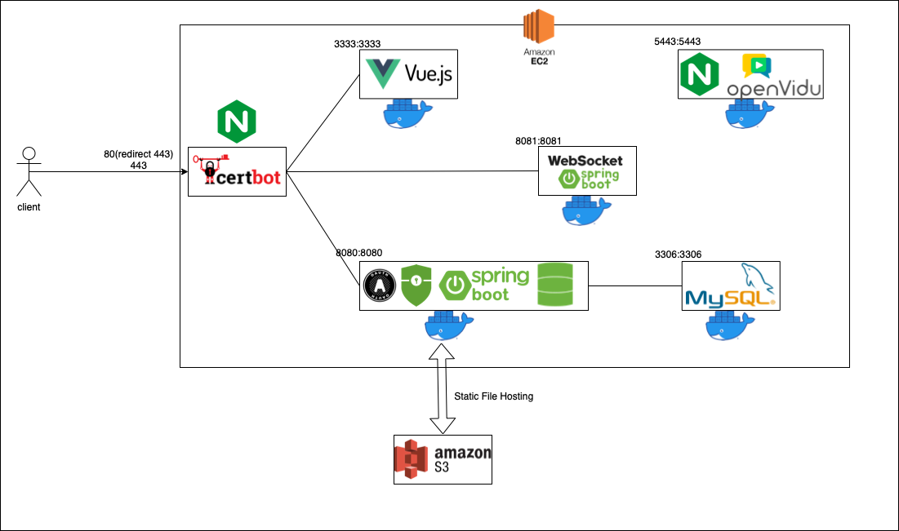

## Fashionity

패션 커뮤니티와 컨설팅을 동시에

 

## 🚀 Services

1. 패션 커뮤니티를 통해 자신의 패션을 자랑하고 타인의 패션 참고 가능
2. 1대1 화상 컨설팅으로 맞춤형 패션 컨설팅 가능

 

## 💻View

[시연 화면](./document/VIEW.md)

## 🏛 System Architecture

 

## 🏭 erd diagram

 

## 🍊 API

[api 기능 정리한 노션 링크](https://www.notion.so/API-63cec18da4574dcdabf91c0cd514f4c3?pvs=4)

 

## 📝 document

[환경 설정 및 배포](./document/setting-distribution.md)  
[mail sender](./document/mail-sender.md)  
[security](./document/security.md)  
[객체지향적 코드](./document/object-oriented.md)  
[소셜로그인](./document/social-login.md)  
[JWT](./document/jwt.md)  
[OpenVidu](./document/openvidu.md)  
[WEBRTC](./document/webrtc.md)

 

## 💻 Developers

<table>
    <tr align="center">
        <td><B>김태현</B></td>
        <td><B>김현욱</B></td>
        <td><B>배이경</B></td>
    </tr>
    <tr align="center">
        <td>
            
             
            <a href="https://github.com/Hyeon0706"><I>Hyeon0706</I></a>
        </td>
        <td>
            
             
            <a href="https://github.com/Hyeon-Uk"><I>Hyeon-Uk</I></a>
        </td>
        <td>
            
             
            <a href="https://github.com/cornchip1"><I>cornchip1</I></a>
        </td>
    </tr>
    <tr align="center">
        <td><B>김은솔</B></td>
        <td><B>정지원</B></td>
        <td><B>한상우</B></td>
    </tr>
    <tr align="center">
        <td>
            
             
            <a href="https://github.com/3unsol"><I>3unsol</I></a>
        </td>
        <td>
            
             
            <a href="https://github.com/jjiione"><I>jjiione</I></a>
        </td>
        <td>
            
             
            <a href="https://github.com/sktkddn777"><I>sktkddn777</I></a>
        </td>
    </tr>
</table>

