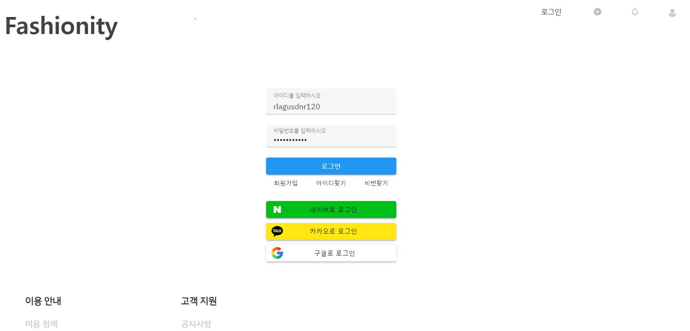
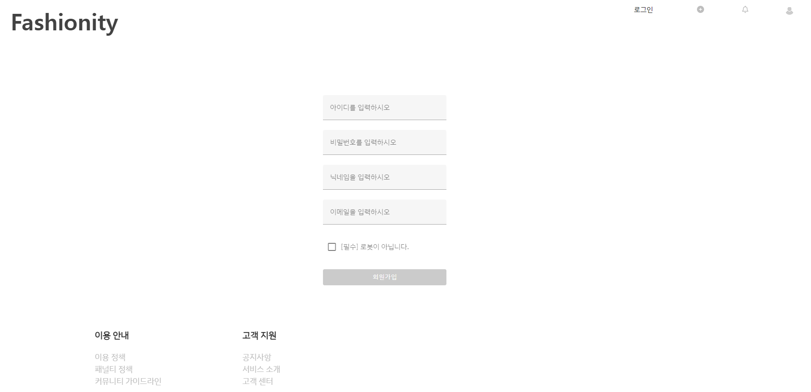
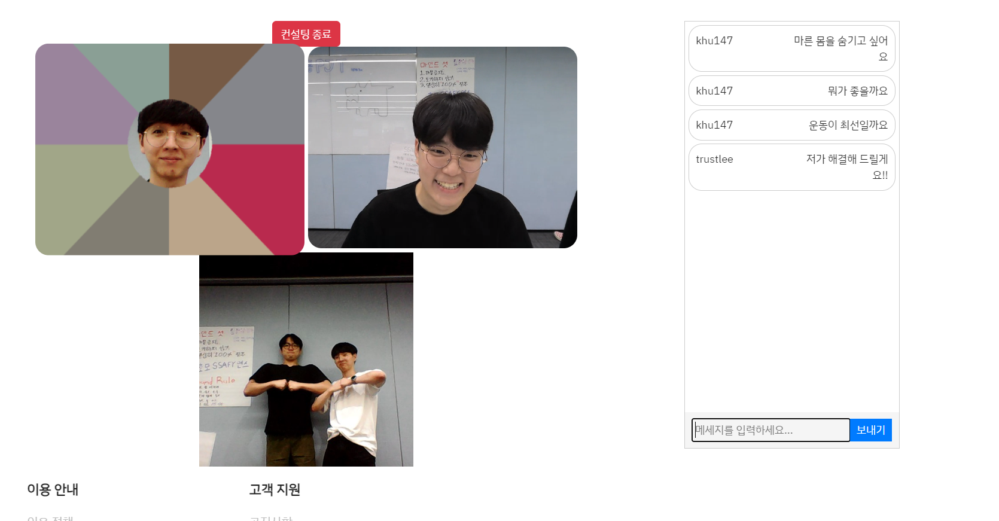

# 메인 페이지

- 커뮤니티의 메인 페이지
- 사람들이 사용한 게시글들을 무한 스크롤로 조회 가능
- 해시태그 입력을 통한 관심사 검색 가능
- 인기순/최신순 정렬을 통한 검색 가능
- 하트버튼을 클릭하여 게시글 좋아요 가능
- 포스트를 눌러 게시글 상세조회 가능

# 게시글 조회

- 게시글에 등록된 이미지, 글, 작성자 프로필 조회 가능
- 댓글 조회, 수정, 삭제 가능
- 게시글 / 댓글 좋아요 가능
- 주인이라면 게시글 삭제 및 수정 가능

# 로그인 페이지

- 로그인 페이지
  - 소셜 로그인
  - 회원가입 버튼으로 회원가입 페이지 이동
  - 아이디 찾기 버튼으로 아이디 찾기 가능
  - 비밀번호 찾기 버튼으로 비밀번호 변경 가능

# 회원가입 페이지

- 정보를 입력하여 회원가입 가능
- 유효성 검사
  

# 프로필 조회

- 프로필 정보 확인
- 내가 작성한 post 조회
- 내가 좋아요한 post 조회
- follower 및 following 관리

# 컨설턴트 목록

- 컨설턴트들의 프로필을 조회 가능

# 컨설턴트 정보 조회 (유저입장)

- 컨설턴트의 평점, 리뷰 조회 가능
- 달력을 이용하여 원하는 날짜에 예약 가능

# 컨설턴트 예약 가능시간 (유저입장)

- 날짜를 선택하여 넘어온 뒤, 원하는 시간대를 선택.
- 파란색 : 가능한 시간
- 회색 : 불가능한 시간

# 상세 예약 정보 등록 (유저입장)

- 키 , 몸무게, 나이, 퍼스널컬러, 참고할 사진, 성별 등을 기록할 수 있는 페이지

# 내 예약 목록 확인하기 (유저입장)

- 컨설팅 예정인 리스트와, 지난 컨설팅을 조회할 수 있음
- 지난 컨설팅은 아래와 같이 후기를 작성할 수 있음
  - 
  - 

# 컨설팅 (유저입장)

- 우측의 채팅창을 통해 실시간 채팅 가능
- 컨설턴트가 퍼스널컬러 진단 및 미리 등록한 이미지를 가지고 컨설팅 가능

# 컨설턴트 예약 확인 (컨설턴트)

- 달력 날짜 아래에 표시로 해당 날짜에 어떤 유저가 예약했는지 확인할 수 있음
- 우측 박스안에 해당 유저에 대한 정보를 조회할 수 있음
  - 

# 컨설턴트 예약 시간 설정 (컨설턴트)

- 컨설턴트는 달력에서 원하는 날짜를 선택하고, 아래의 시간을 설정하여 컨설팅 가능 시간을 설정할 수 있다.

# 컨설팅 (컨설턴트)

- 컨설턴트도 채팅 가능
- 퍼스널 컬러를 선택하여 사용자의 퍼스널컬러 진단 가능
- 미리 등록한 이미지를 띄워 참고 가능
